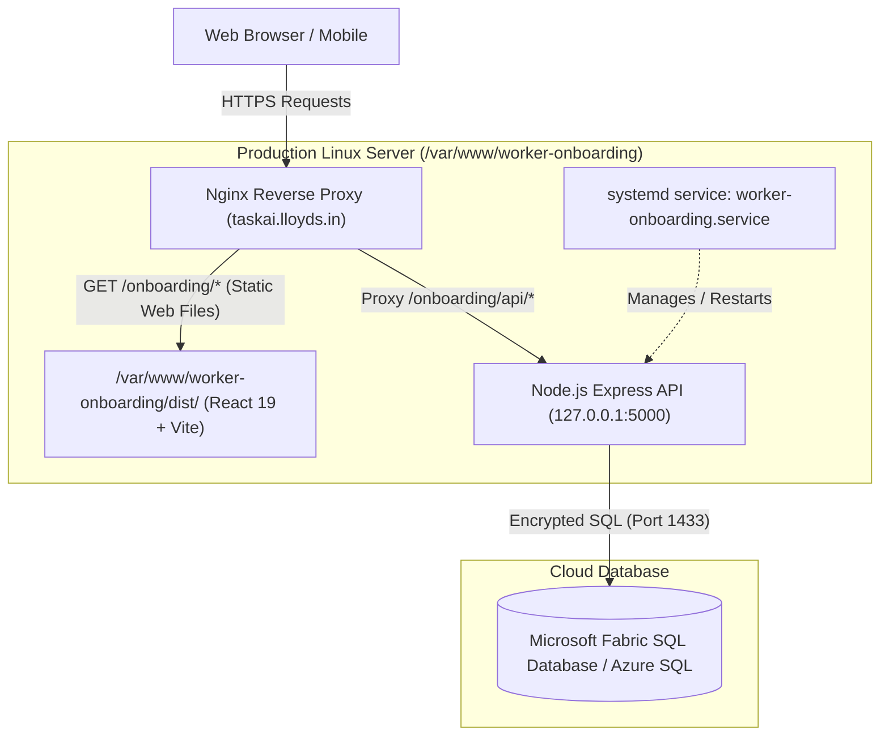

# Worker Onboarding Hosting & Deployment Documentation

This document provides a comprehensive runbook of how the **Lloyds Worker Onboarding & Camp Management Application** (Frontend, Backend, and Database) is configured, built, and hosted in production on the Linux server under the domain **`taskai.lloyds.in`**.

---

## 1. Hosting Architecture & Topology



---

## 2. Server & Domain Specifications

| Component                   | Detail                                                 |
| --------------------------- | ------------------------------------------------------ |
| **Domain**            | `https://taskai.lloyds.in`                           |
| **Frontend Web Path** | `https://taskai.lloyds.in/onboarding/`               |
| **Backend API Path**  | `https://taskai.lloyds.in/onboarding/api/`           |
| **Internal API Port** | `http://127.0.0.1:5000`                              |
| **Operating System**  | Linux (Ubuntu / Debian) with`systemd` and `nginx`  |
| **Deploy Directory**  | `/var/www/worker-onboarding/`                        |
| **Process User**      | `www-data`                                           |
| **GitHub Repository** | `https://github.com/lloyds-it/worker-onboarding.git` |

---

## 3. Database Layer Setup

- **Platform**: Microsoft Fabric SQL Database / Azure SQL Server.
- **Database Name**: `Worker_onboarding-ef0fbf2a-a528-4ed3-ae76-4fcc1f9e531a`
- **Authentication**: Azure Active Directory Service Principal (`@azure/identity`) or AD Password.
- **DDL Scripts**: Found in [`database/fabric_schema.sql`](database/fabric_schema.sql).
- **Connection Configuration**: Configured in `.env`:

```env
PORT=5000
FABRIC_SERVER=2xv4ddeoefeuhhgixzuzuy3udm-s2pfycav32ku5anvzm7d4vfmqi.database.fabric.microsoft.com
FABRIC_DATABASE=Worker_onboarding-ef0fbf2a-a528-4ed3-ae76-4fcc1f9e531a
FABRIC_PORT=1433
FABRIC_AUTH_TYPE=azure-active-directory-service-principal-secret

AZURE_TENANT_ID=8cc1ebd5-218e-4349-9cc8-be699a63741b
AZURE_CLIENT_ID=ab0981e7-bc93-4d13-81b2-4f7d08871064
AZURE_CLIENT_SECRET=your-secret-here
FABRIC_WORKSPACE="Software Databases"
```

---

## 4. Backend Hosting (Node.js Express API)

### 4.1. Server Location on Linux

The application is deployed directly to:

```bash
/var/www/worker-onboarding/
```

### 4.2. Base Path Routing

The backend handles API requests under `/api/` natively, and Nginx maps `/onboarding/api/` directly to `http://127.0.0.1:5000/api/`.

### 4.3. Systemd Service Configuration

Service file location: `/etc/systemd/system/worker-onboarding.service`
(Tracked in repository at [`.deployment/worker-onboarding.service`](.deployment/worker-onboarding.service))

```ini
[Unit]
Description=Node.js Web API & Server for Lloyds Worker Onboarding
After=network.target

[Service]
WorkingDirectory=/var/www/worker-onboarding
ExecStart=/usr/bin/node /var/www/worker-onboarding/server/server.js
Restart=always
# Restart service after 10 seconds if service crashes:
RestartSec=10
KillSignal=SIGINT
SyslogIdentifier=worker-onboarding
User=www-data
Environment=NODE_ENV=production
Environment=PORT=5000

[Install]
WantedBy=multi-user.target
```

### 4.4. Managing the Backend Service

```bash
# Reload systemd when service file changes
sudo systemctl daemon-reload

# Enable to start automatically on system boot
sudo systemctl enable worker-onboarding

# Start / Restart / Stop
sudo systemctl restart worker-onboarding
sudo systemctl status worker-onboarding

# View live service logs
journalctl -u worker-onboarding -f
```

---

## 5. Frontend Hosting (React 19 + Vite)

### 5.1. Build Command

The React frontend is built using Vite with relative/base-path awareness:

```bash
cd /var/www/worker-onboarding
npm run build
```

The output directory `/var/www/worker-onboarding/dist/` is served directly by Nginx.

### 5.2. API Resolution Strategy

Defined dynamically in [`src/services/apiService.js`](src/services/apiService.js):

- **Local Dev**: Resolves to `/api` (proxied to `http://127.0.0.1:5000`).
- **Production (`https://taskai.lloyds.in/onboarding/`)**: Automatically detects the `/onboarding` prefix and routes API requests to `https://taskai.lloyds.in/onboarding/api/`.

### 5.3. Cache-Busting Mechanism

To prevent browsers from caching stale bundles after redeployments, Nginx attaches cache-control headers:

```nginx
if ($request_uri ~* "(\/index\.html)$") {
    add_header Cache-Control "no-store, no-cache, must-revalidate, proxy-revalidate, max-age=0";
    expires off;
}
```

---

## 6. Nginx Reverse Proxy Configuration

Configuration file location: `/etc/nginx/sites-available/worker-onboarding` (symlinked to `/etc/nginx/sites-enabled/`)
(Tracked in repository at [`.deployment/nginx.conf`](.deployment/nginx.conf))

```nginx
# 1. Route for the React Web Frontend
location /onboarding/ {
    alias /var/www/worker-onboarding/dist/;
    try_files $uri $uri/ /onboarding/index.html;
  
    # Disable caching for index.html for instant updates upon redeployment
    if ($request_uri ~* "(\/index\.html)$") {
        add_header Cache-Control "no-store, no-cache, must-revalidate, proxy-revalidate, max-age=0";
        expires off;
    }

    # Static assets long-term caching
    location ~* \.(?:ico|css|js|gif|jpe?g|png|woff2?|eot|ttf|svg)$ {
        expires 30d;
        add_header Cache-Control "public, max-age=2592000, immutable";
    }
}

# 2. Route for the Node.js Express Backend API
location /onboarding/api/ {
    proxy_pass         http://127.0.0.1:5000/api/;
    proxy_http_version 1.1;
    proxy_set_header   Upgrade $http_upgrade;
    proxy_set_header   Connection keep-alive;
    proxy_set_header   Host $host;
    proxy_cache_bypass $http_upgrade;
    proxy_set_header   X-Forwarded-For $proxy_add_x_forwarded_for;
    proxy_set_header   X-Forwarded-Proto $scheme;
    proxy_set_header   X-Real-IP $remote_addr;

    # Timeouts for database operations & report generation
    proxy_connect_timeout 60s;
    proxy_send_timeout 60s;
    proxy_read_timeout 60s;
}
```

### Reloading Nginx

```bash
sudo nginx -t
sudo systemctl reload nginx
```

---

## 7. Initial Server Setup from GitHub

On your Linux server:

```bash
# 1. Create web directory
sudo mkdir -p /var/www/worker-onboarding
sudo chown -R $USER:$USER /var/www/worker-onboarding

# 2. Clone from GitHub
git clone https://github.com/lloyds-it/worker-onboarding.git /var/www/worker-onboarding
cd /var/www/worker-onboarding

# 3. Create .env with production credentials
cp .env.example .env
nano .env

# 4. Install dependencies and build
npm ci
npm run build

# 5. Set up systemd service
sudo cp .deployment/worker-onboarding.service /etc/systemd/system/
sudo systemctl daemon-reload
sudo systemctl enable worker-onboarding
sudo systemctl start worker-onboarding

# 6. Configure Nginx
# Add the location blocks from .deployment/nginx.conf into /etc/nginx/sites-available/taskai.lloyds.in
sudo nginx -t
sudo systemctl reload nginx

# 7. Set permissions for www-data
sudo chown -R www-data:www-data /var/www/worker-onboarding
sudo chmod -R 755 /var/www/worker-onboarding
```

---

## 8. Redeployment Runbook (Quick Steps)

When publishing updates from GitHub to production:

```bash
cd /var/www/worker-onboarding

# Option A: One-line automated script
chmod +x .deployment/deploy.sh
./.deployment/deploy.sh

# Option B: Manual step-by-step
git pull origin main
npm ci
npm run build
sudo chown -R www-data:www-data /var/www/worker-onboarding
sudo systemctl restart worker-onboarding
sudo systemctl reload nginx
```
